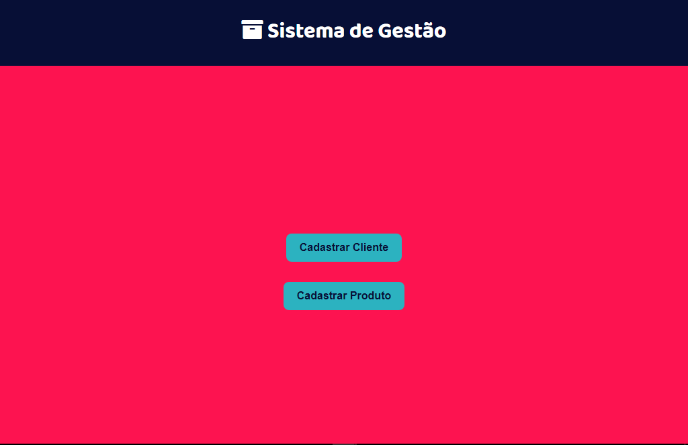
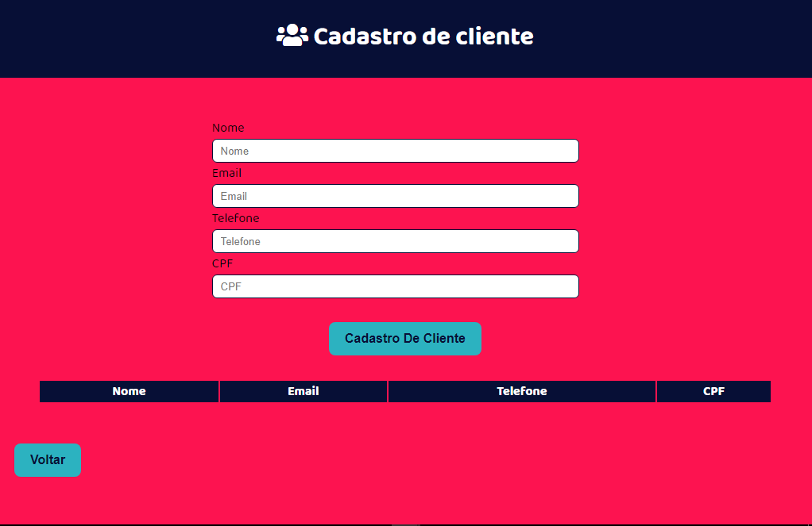
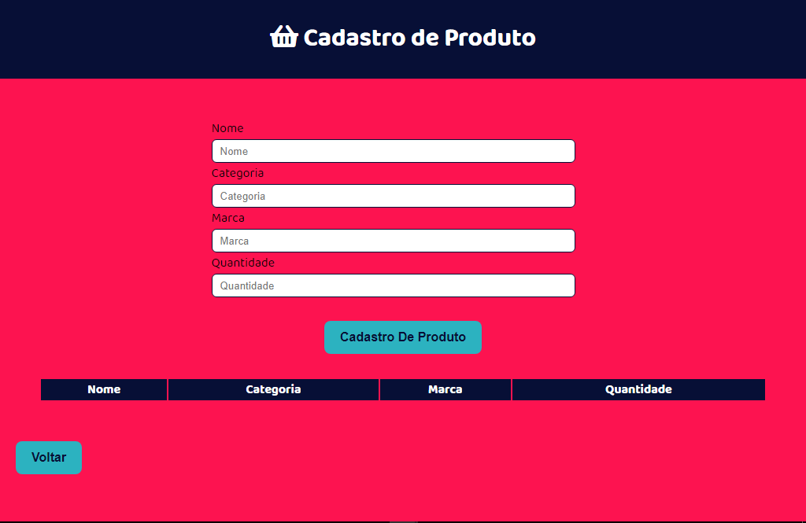
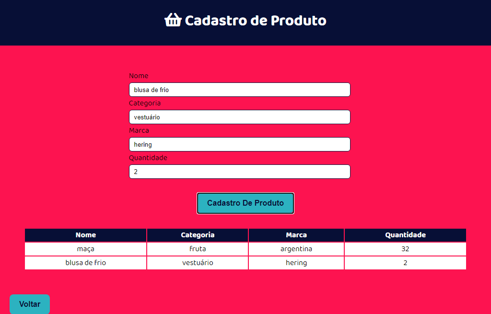

<h1>  🚀 Sistema de Gestão de Cadastro </h1> 

Projeto desenvolvido durante o Hiring Coders promovido pela Gama Academy.

 O Desafio consiste em criar um sistema e-commerce para inventário de produtos e dados de clientes.

 <h2>🛠 Linguagens e Ferramentas:</h2>
<ul><li>HTML</li>
    <li>CSS</li>
    <li>JavaScript</li>
    </ul>
 
 
<h2>📝Conhecimentos adquiridos:</h2>
 
 
Armazenamento em local storage

 
Artribuição com formulário

 
 <h2>📝Futuras implementações:</h2>
 
 
inserção do sweet alert

 
 <h2>Imagem da página construida:</h2>
 
 
 
 
 

